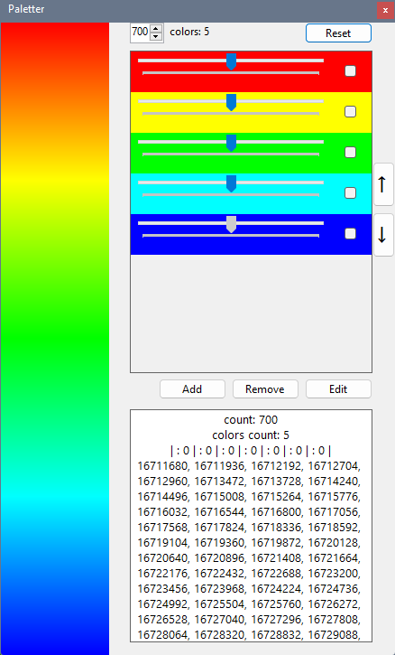

# Paletter
Алгоритм, позволяющий создавать линейные гибко-настраивыемые цветовые палитры.




## Примеры использования
В качестве примера использования "Paletter" было создано два приложения: на [Win32](https://github.com/codev01/Paletter/tree/master/ExampleWin32) и [консольное](https://github.com/codev01/Paletter/tree/master/ExampleConsole).

## Лицензия
Проект "Paletter" распростряняется по копилефтной лицензии [GPL-3.0](https://github.com/codev01/Paletter/blob/master/LICENSE) бесплатно. По лицензии проект "Paletter" может быть использован в коммерческих целях, подлежит модификации и пригоден для частного использования. При использовании нараоток из проекта не забудьте указать автора проекта "Paletter".

```
                    GNU GENERAL PUBLIC LICENSE
                       Version 3, 29 June 2007

 Copyright (C) 2007 Free Software Foundation, Inc. <https://fsf.org/>
 Everyone is permitted to copy and distribute verbatim copies
 of this license document, but changing it is not allowed.
```
